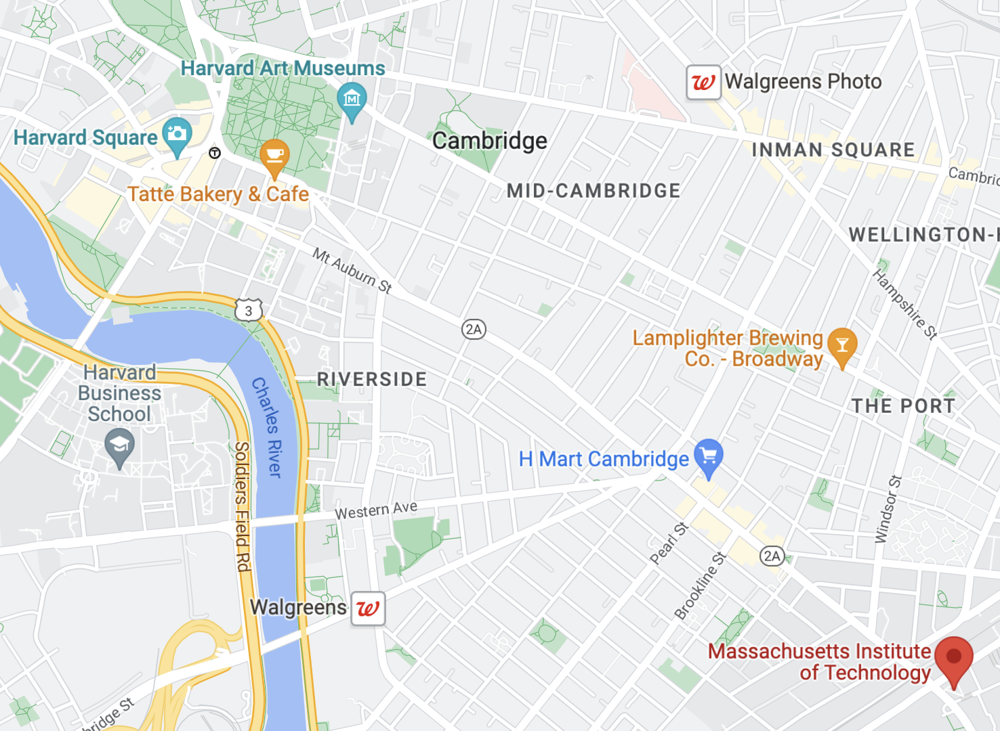

# Real-Time-Bus-Tracker
## This map shows the stops for the bus between MIT and Harvard. It will loop through where the bus stops are on the map, then return to MIT.

How To Run: Fork the code and use your own API score. This will allow you to use the map at your discretion and avoid having too many people using the same API - causing the system to crash. Then open a blank browset, and watch the bus travel through Cambridge, MA.

License: This project is under the MIT XPro license for the coding course.
